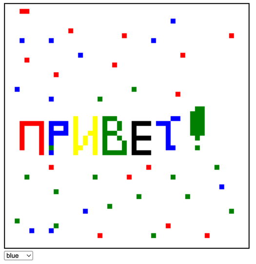

Небольшой аналог игры PixelBattle

Флаги:
`-a` - порт для запуска, по умолчанию :8080
`-t` - время обновления поля у каждого пользователя. По умолчанию 1 секунда.
`-s` - ширина и высота поля. По умолчанию 60.

Используются вебсокеты для обновления поля

`/draw` - тут происходит весь основной процесс рисования

`/clear` - происходит очищение поля

Дополнительно сделал небольшой сайт, для демонстрации проекта

